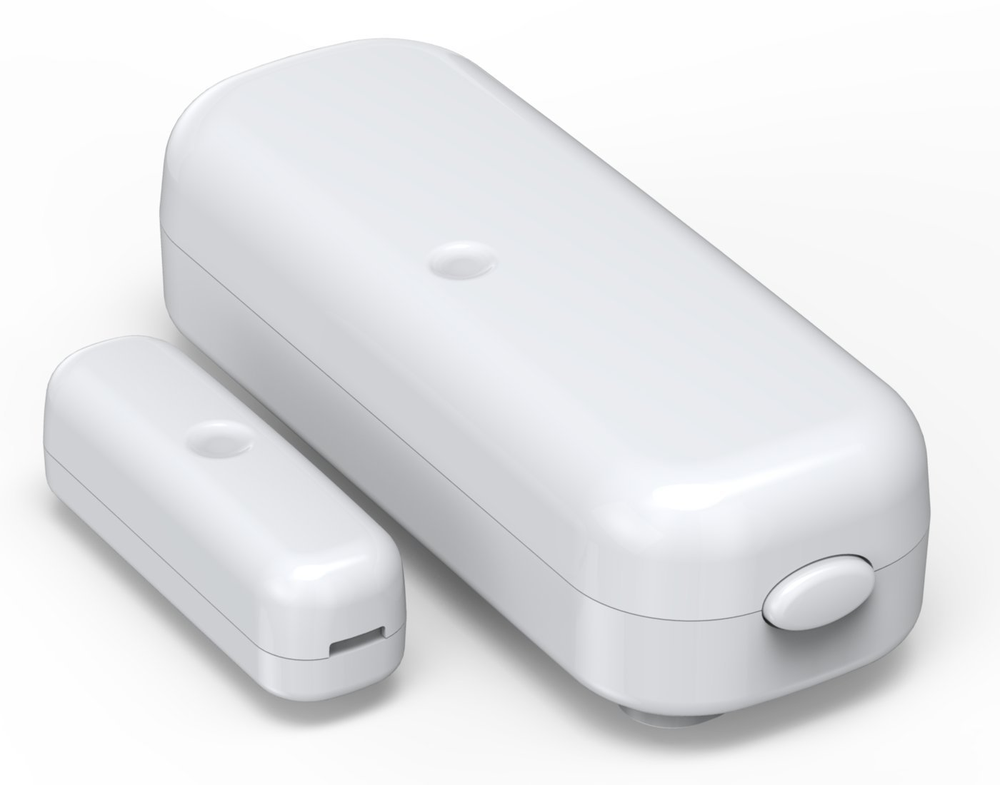
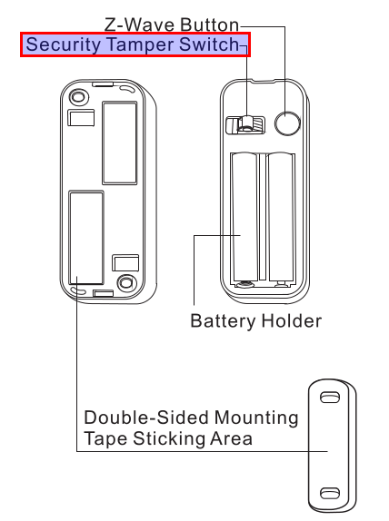
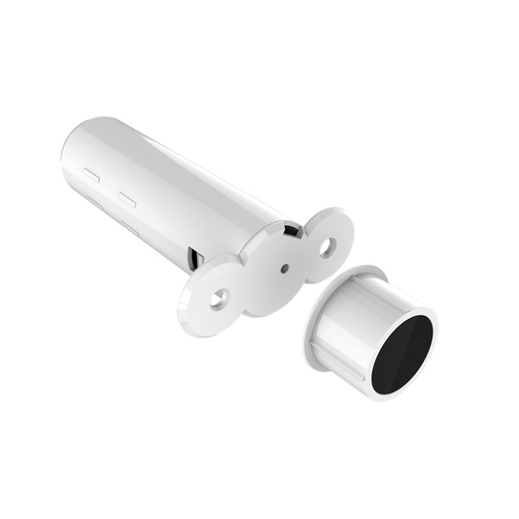
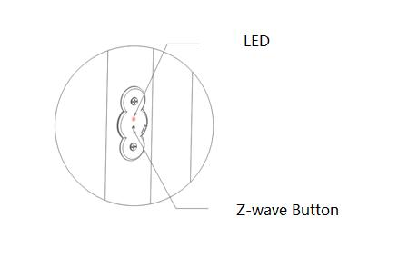
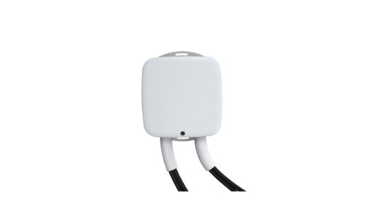
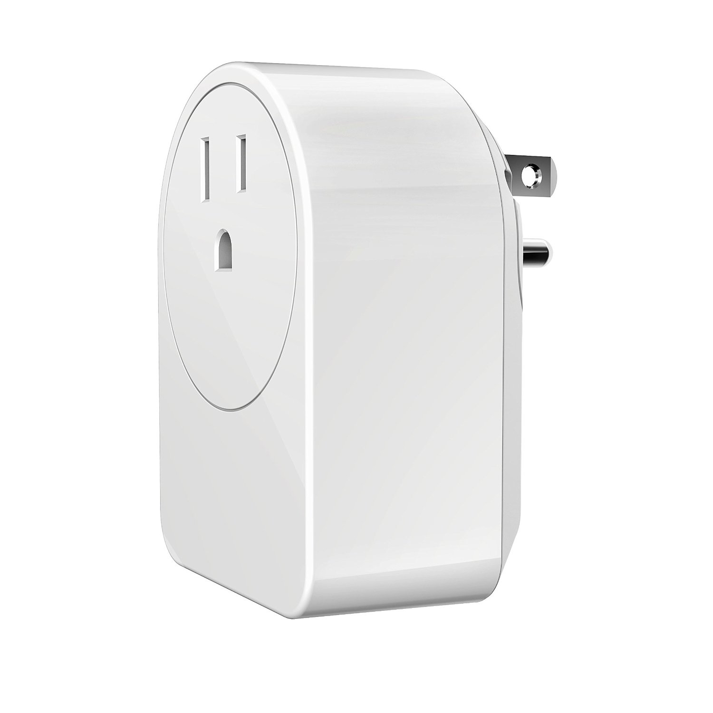
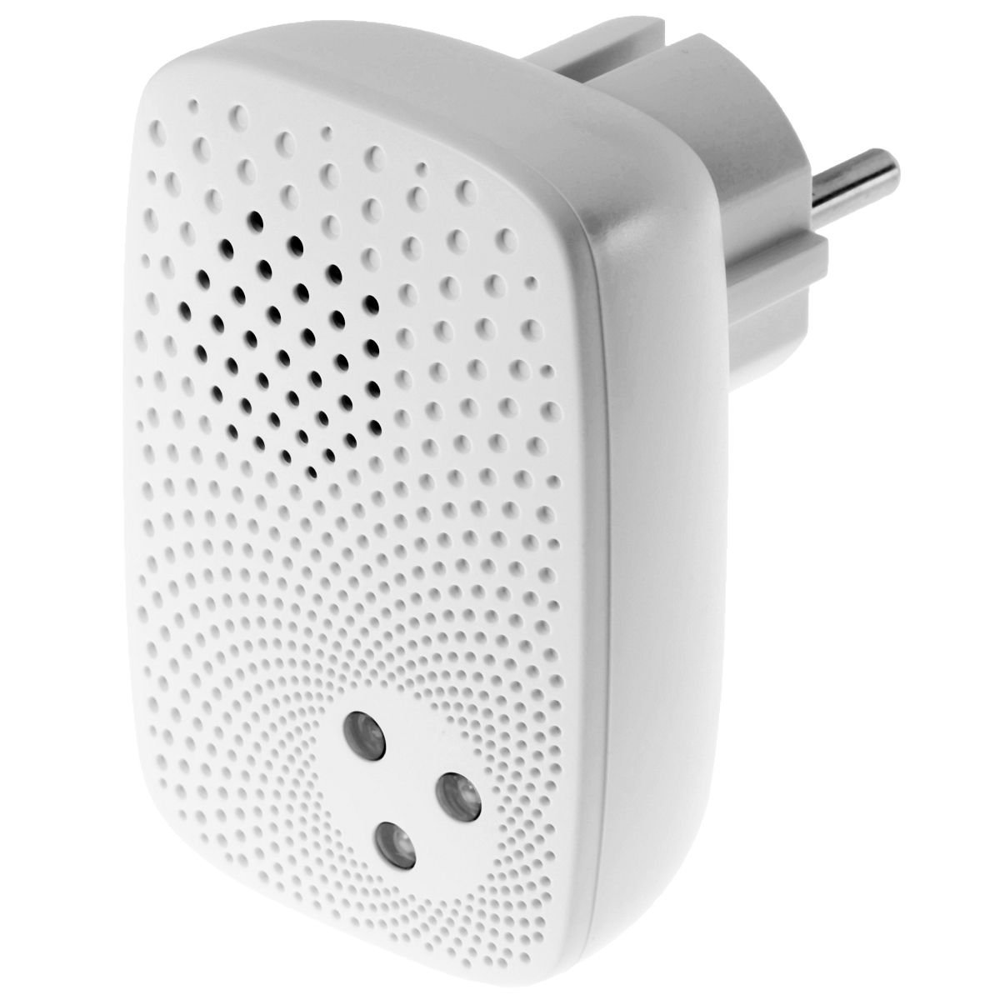
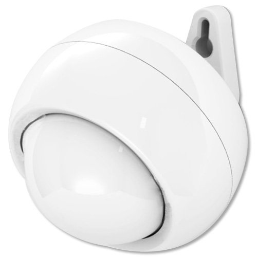
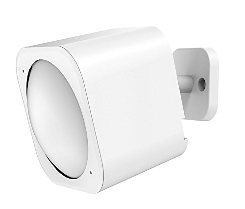

.. _aeotec_configuration_anchor:

Aeotec 
======================

Please note that the following devices should be waken up before doing configuration  

.. _aeotec_config_door_window_sensor:

Door and Window Sensor (GEN 2) 
--------------------------------

Wake-up 
~~~~~~~~~~

The Aeotec Door and Window Sensor can be made to stay awake for 10 minutes by firmly tapping the security switch 3 times in quick succession. Once the Aeotec Door and Window Sensor has been waken, the LED will blink every few seconds indicating that it is now awake.

Configuration   
~~~~~~~~~~~~~~~~

.. list-table:: 
   :widths: 15 30
   :header-rows: 1

   * - Signal Trigger Device
     - Description
   * - ON 
     - When it is open, the associated devices are triggered as ON. If It is closed, the associated devices are triggered as OFF.
   * - OFF 
     - When it is open, the associated devices are triggered as OFF. If It is closed, the associated devices are triggered as ON.

.. list-table::  
    :widths: 15 30
    :header-rows: 1

    * - Signal Trigger Controller
      - Description 
    * - 0x00
      - When it is open, the controller is triggered as ON. If It is closed, the controller is triggered as OFF.
    * - 0xFF
      - When it is open, the controller is triggered as OFF. If it is closed, the controller is triggered as ON.

.. list-table::  
   :header-rows: 1

   * - Report to
   * - Device & Controller with Battery Information
   * - Device & Controller
   * - Device
   * - Controller
   * - Controller with Battery Information
   * - Battery Information

Specification
~~~~~~~~~~~~~~~
:download:`Download <../_static/specification/zwave/AeonLabs/1_2_Gen/DoorNWindowSensor/21DoorWindowSensor.pdf>`

.. _aeotec_config_recessed_door_sensor_gen5:

Recessed Door Sensor (Gen 5) 
------------------------------

Wake-up 
~~~~~~~~~

The Aeotec Recessed Door Sensor can be made to stay awake for 10 seconds by pressing the z-wave button for 6 seconds.

Configuration   
~~~~~~~~~~~~~~~~

.. list-table::  
   :widths: 15 30
   :header-rows: 1

   * - Configuration 
     - Description
   * - Enable  
     - Allow the configuration  
   * - Disable   
     - Not allow the configuration 

.. list-table:: 
   :widths: 15 30
   :header-rows: 1

   * - Signal Trigger Device
     - Description
   * - ON 
     - When it is open, the associated device is triggered as ON. If It is closed, the associated device is triggered as OFF.
   * - OFF 
     - When it is open, the associated device is triggered as OFF. If it is closed, the associated device is triggered as ON.

.. list-table::  
    :widths: 15 30
    :header-rows: 1

    * - Signal Trigger Controller
      - Description 
    * - 0x00
      - When it is open, the controller is triggered as ON. If It is closed, the controller is triggered as OFF.
    * - 0xFF
      - When it is open, the controller is triggered as OFF. If it is closed, the controller is triggered as ON.

.. list-table::  
   :header-rows: 1

   * - Report To
   * - Device & Controller
   * - Device
   * - Controller 
   * - Nothing

The low battery notification can be configured if it sends a Low battery notification. 
If it is enable, a low battery is notified. Otherwise, it is NOT notified.  

.. list-table::  
    :widths: 15 30
    :header-rows: 1

    * - Low Battery Notification 
      - Description 
    * - Enable 
      - Send a notification when the battery is low.
    * - Disable 
      - Do not send a notification when the batter is low.

Specification
~~~~~~~~~~~~~~~
:download:`Download <../_static/specification/zwave/AeonLabs/1_2_Gen/DoorRecesseSensor/23RecessedDoorSensor.pdf>`

.. _aeotec_config_heavy_duty_smart:

Heavy Duty Smart  
------------------

Configuration   
~~~~~~~~~~~~~~~~

.. .. list-table::  
..    :widths: 15 30
..    :header-rows: 1

..    * - Configuration 
..      - Description
..    * - Enable  
..      - Allow the configuration  
..    * - Disable   
..      - Not allow the configuration 

.. list-table::  
   :widths: 15 30
   :header-rows: 1

   * - Signal Trigger Controller 
     - Description
   * - Nothing 
     - Do NOT send the notification when the device is switched ON/OFF
   * - Enable  
     - Send the notification when the device is switched ON/OFF

Specification
~~~~~~~~~~~~~~~
:download:`Download <../_static/specification/zwave/AeonLabs/5_6_Gen/AeonLabsHeavyDutySmart/z_wave_aeon_labs_heavy_duty_switch_engineering_specification.pdf>`

.. _aeotec_config_smart_dimmer:

Smart Dimmer
--------------

Configuration   
~~~~~~~~~~~~~~~~

.. .. list-table::  
..    :widths: 15 30
..    :header-rows: 1

..    * - Configuration 
..      - Description
..    * - Enable  
..      - Allow the configuration  
..    * - Disable   
..      - Not allow the configuration 

.. list-table::  
   :widths: 15 30
   :header-rows: 1

   * - Signal Trigger Controller 
     - Description
   * - Disable 
     - Do not send the notification when the device is switched ON/OFF 
   * - Enable 
     - Send the a notification when the device is switched ON/OFF

Specification
~~~~~~~~~~~~~~~
:download:`Download <../_static/specification/zwave/AeonLabs/1_2_Gen/SmartDimmer/15SmartDimmerG2.pdf>`

.. _aeotec_config_siren:

Siren
--------

Configuration   
~~~~~~~~~~~~~~~~

.. list-table::  
   :header-rows: 1

   * - Sound Type  
     - Description 
   * - Sound type 1
     - Change to sound type 1  
   * - Sound type 2  
     - Change to sound type 2
   * - Sound type 3 
     - Change to sound type 3
   * - Sound type 4  
     - Change to sound type 4
   * - Sound type 5 
     - Change to sound type 5

.. list-table::  
   :header-rows: 1

   * - Volume  
     - Description 
   * - Low  
     - Change volume low 
   * - Medium 
     - Change volume medium
   * - High  
     - Change volume high 

.. .. list-table::  
..    :widths: 15 30
..    :header-rows: 1

..    * - Report To
..      - Description
..    * - Nothing 
..      - Do not send the notification when the state of siren is changed 
..    * - Controller
..      - Send the notification when the state of siren is changed

Specification
~~~~~~~~~~~~~~~
:download:`Download <../_static/specification/zwave/AeonLabs/5_6_Gen/AeonLabsSiren/10SirenGen5.pdf>`

.. _aeotec_config_multilevel_sensor_gen5:

Multilevel sensor 5
---------------------

Configuration   
~~~~~~~~~~~~~~

.. list-table::  
   :widths: 15 30
   :header-rows: 1

   * - Motion Detection  
     - Description
   * - Enable 
     - Enable motion detection  
   * - Disable 
     - Disable motion detection 

.. list-table::  
   :widths: 15 30
   :header-rows: 1

   * - Sensor Report Type  
     - Description
   * - Temperature  
     - Report temperature  
   * - Humidity 
     - Report humidity 
   * - Luminance  
     - Report luminance 
   * - Battery 
     - Report battery

By default, the associated device is triggered OFF if the motion is ceased for 4 minutes. 
This amount of time can be configured as follows. 

.. list-table::  
   :widths: 15 30
   :header-rows: 1

   * - Interval Time 
     - Description
   * - 1 ... 15300    
     - Set this amount of time to device 

The sensor will automatically send report of temperature, humidity, luminance and battery for 1800 seconds interval. 
And this interval of time could be configured as follows. 

.. list-table:: 
   :widths: 15 30
   :header-rows: 1

   * - Auto Report Interval 
     - Description
   * - 5 ... 2678400 
     - Set this amount of time to device 

Specification
~~~~~~~~~~~~~~~
:download:`Download <../_static/specification/zwave/AeonLabs/5_6_Gen/Multilevel5/8MultiSensorGen5.pdf>`

.. _aeotec_config_multilevel_sensor_gen6:

Multilevel sensor 6
---------------------

Configuration   
~~~~~~~~~~~~~~

.. .. list-table::  
..    :widths: 15 30
..    :header-rows: 1

..    * - Configuration 
..      - Description
..    * - Enable  
..      - Allow the configuration  
..    * - Disable   
..      - Not allow the configuration 

By default, the associated devices will be triggered OFF the motion is ceased for 4 minutes. 
This amount of time can be configured as following table 

.. list-table::  
   :widths: 15 30
   :header-rows: 1

   * - Interval Time 
     - Description
   * - 10 ... 3600    
     - Set this amount of time to device 

.. list-table::  
   :widths: 15 30
   :header-rows: 1

   * - Report Type  
     - Description
   * - Temperature  
     - Report temperature  
   * - Humidity 
     - Report humidity 
   * - Luminance  
     - Report luminance 
   * - Battery 
     - Report battery
   * - Ultraviolet 
     - Report ultraviolet
   * - Disable 
     - Do not send report

The sensity of motion sensor could be configured as follows. 
Level 5 is the most sensitive. 

.. list-table::  
   :widths: 15 30
   :header-rows: 1

   * - Motion sensity   
     - Description
   * - Disable 
     - Disable motion sensor  
   * - Level 1
     - Set motion sensity to level 1 
   * - Level 2
     - Set motion sensity to level 2
   * - Level 3
     - Set motion sensity to level 3 
   * - Level 4
     - Set motion sensity to level 4 
   * - Level 5
     - Set motion sensity to level 5 

The sensor will automatically send report of temperature, humidity, luminance and battery for 3600 seconds interval. 
And this interval of time could be configured as follows. 

.. list-table:: 
   :widths: 15 30
   :header-rows: 1

   * - Auto Interval Time 
     - Description
   * - 5 ... 2678400 
     - Set this amount of time to device 

Specification
~~~~~~~~~~~~~~~
:download:`Download <../_static/specification/zwave/AeonLabs/5_6_Gen/Multilevel6/9MultiSensor6.pdf>`
