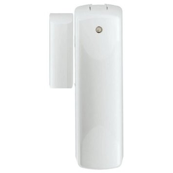
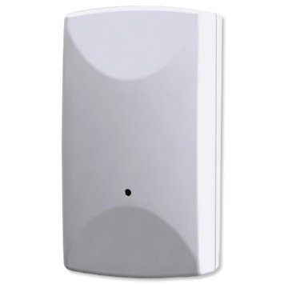
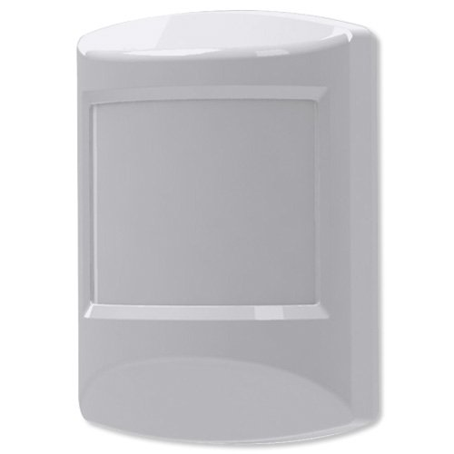

Ecolink
======================

.. _ecolink_config_door_window_sensor:

Door and Window Sensor
-----------------------

Wake-up device 
~~~~~~~~~~~~~~~
This device is waken by triggering open/close event of this device

Configuration  
~~~~~~~~~~~~~~~

Association group two is intended for any device that is controllable with a Basic Set of 0xFF such as lights, sirens, or chimes. When a Tilt sensor is faulted, it will always send a Basic Set of 0xFF to all nodes associated to group two. When the Tilt sensor is restored, it is configurable if the Basic Set of 0x00 is sent to all nodes associated to group two. The following table shows the configuration

.. list-table:: 
   :widths: 15 30
   :header-rows: 1

   * - Signal Trigger Device
     - Value
   * - ON  
     - The associated devices are triggered as OFF when it is closed.
   * - OFF 
     - The associated devices are NOT triggered as OFF when when it is closed.  

.. _ecolink_config_tilt_sensor:

Tilt Sensor  
---------------

Wake-up device 
~~~~~~~~~~~~~~~
This device is waken by rotation 

Configuration  
~~~~~~~~~~~~~~~

Association group two is intended for any device that is controllable with a Basic Set of 0xFF such as lights, sirens, or chimes. When a Tilt sensor is faulted, it will always send a Basic Set of 0xFF to all nodes associated to group two. When the Tilt sensor is restored, it is configurable if the Basic Set of 0x00 is sent to all nodes associated to group two.  The following table shows the configuration

.. list-table:: 
   :widths: 15 30
   :header-rows: 1

   * - Signal Trigger Device
     - Description
   * - ON  
     - The associated devices are triggered as OFF when it is restored.
   * - OFF 
     - The associated devices are NOT triggered as OFF when when it is restored. 

.. _ecolink_config_motion_detector_sensor:

Motion Detector 
------------------

Wake-up device 
~~~~~~~~~~~~~~~
This device is waken by triggering motion 

Configuration  
~~~~~~~~~~~~~~~

Association group two is intended for any device that is controllable with a Basic Set of 0xFF such as lights, sirens, or chimes. When a Motion sensor is faulted, it will always send a Basic Set of 0xFF to all nodes associated to group two. When the Motion sensor is restored, it is configurable if the Basic Set of 0x00 is sent to all nodes associated to group two. The following table shows the configuration

.. list-table:: 
   :widths: 15 30
   :header-rows: 1

   * - Signal Trigger Device
     - Value
   * - ON  
     - The associated devices are triggered as OFF when when it ends motion.   
   * - OFF 
     - The associated devices are NOT triggered as OFF when when it ends motion.   

